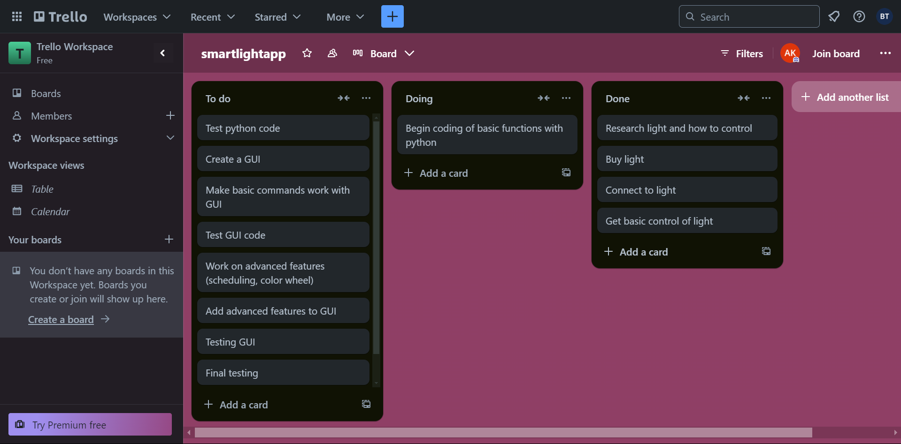
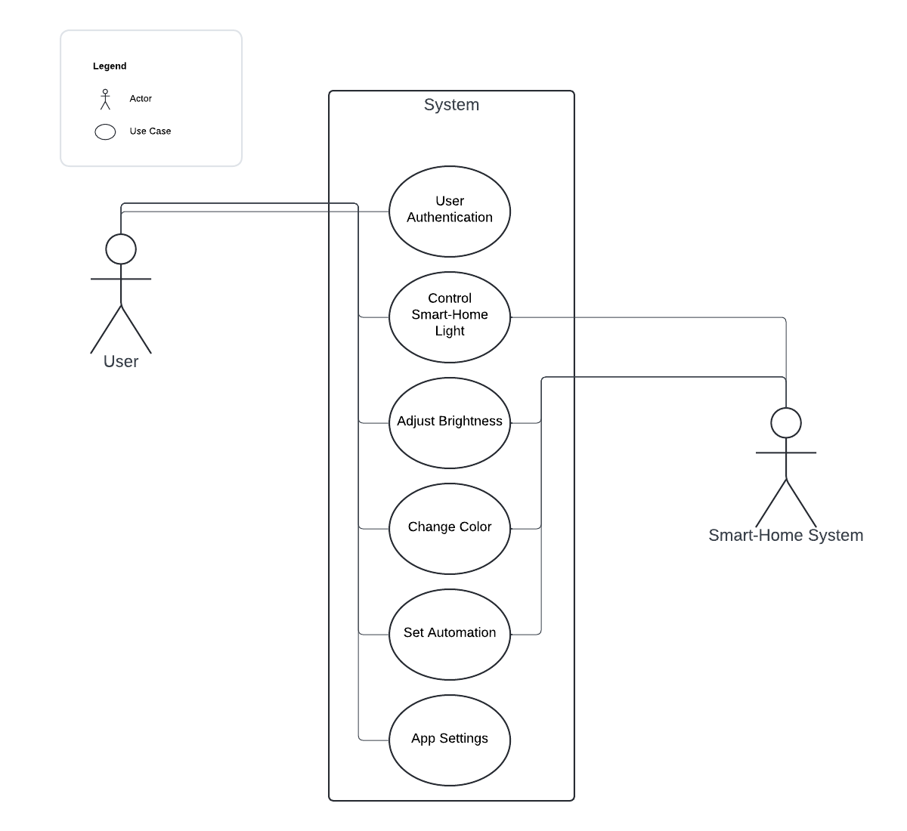

```
Introduction to Software Engineering - CIS 350
```

### SmartLight: A Desktop GUI Smart Light Control App

---
### Made by:
#### Adam Kroese (Project Manager)
#### Ben Turner (Lead Programmer)
---
## 1 Abstract

With the growing trend of mobile applications abandoning support for smart-home devices, users are left without reliable control over their connected homes. This project addresses this issue by developing a robust desktop application designed to ensure long-term control over smart-home lighting systems, independent of third-party apps that may lose support in the future. Our solution focuses on creating a user-friendly interface that allows seamless control over smart-home lights, offering features such as brightness adjustment, color changes, and scheduled automation. By eliminating the reliance on volatile mobile apps, this desktop application provides a stable and future-proof platform, empowering users to manage their smart-home lighting systems efficiently and with confidence for years to come.

## 2 Introduction

In recent years, smart-home devices have become integral to modern living, offering convenience and control over various household systems. However, many users face the challenge of mobile applications suddenly abandoning support for these devices, leaving them without a reliable way to manage their homes. This project seeks to solve that problem by developing a desktop application specifically designed for controlling smart-home lighting systems. Unlike mobile apps that can lose support or functionality over time, this desktop solution offers a future-proof alternative, ensuring continuous control and accessibility for users. Our goal is to provide a stable and long-lasting application that does not depend on third-party developers or evolving app stores. The desktop app allows users to control their smart-home lights with ease, offering features such as on/off control, brightness adjustment, color customization, and automated scheduling. With its intuitive interface and focus on longevity, this app empowers users to confidently manage their smart-home lighting systems, knowing their control will not be interrupted by unsupported mobile apps. This solution will benefit those seeking reliable, long-term smart-home management, offering an accessible and durable platform.

### 2.1 Trello

We used Trello to manage tasks and track progress throughout the project. Trello helped us break down the project into manageable tasks to be done one at a time. It allowed us to prioritize each task one by one in order to track issues and address problems as we worked on it. Overall, Trello kept our team and project itself organized and on track, ensuring we met all of our project goals.

<p align="center">
  
  <br>
  <br>
  Figure 1: Trello
</p>

## 3 Architectural Design

### 3.1 Use Case Diagram

In a use case diagram for a this SmartLight app, the primary actor is the User who interacts with functionalities like controlling the Smart-Home light by turning it on/off, asjuting the brightness, changing the color, and setting automation. Along with interacting with user authenication when opening the app and interacing with the app's settings. While the Smart-Home system or light itself, covers the same four functionalities that the user interacts with. This diagram outlines the essential interactions and functionalities between the user and the Smart-Home system.

<p align="center">
  
  <br>
  <br>
  Figure 2: Use Case Diagram
